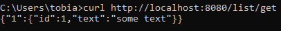
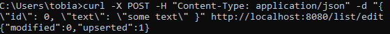
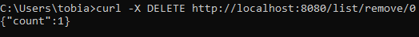

# ТЗ для ППИ
Сервис позволяет работать со списком с помощью API, который имеет 3 эндпоинта:
* Эндпоинт удаления - удаляет в базе запись
  /list/get
* Эндпоинт изменения - изменяет в базе запись
  /list/edit
* Эндпоинт показать - показывает текущий актуальный список
  /list/remove/{id}

#### Элементы списка имеют вид
```go
type Element struct {
	ID   int    `json:"id"`
	Text string `json:"text"`
}
```
### Использованные ресурсы
* Docker/Docker compose
> Нужен для унифицированной и простой развёртки
* Gorilla mux
> Использовался для упрощения рутинга
* MongoDB
> Использовался в качестве БД

### Инструкция по запуску
Для запуска сервиса достаточно поднять контейнеры:
```sh
docker-compose up -d --build
```

### Взаимодействие
Примеры HTTP запросов:
* /list/get
```sh
curl http://localhost:8080/list/get
```

* /list/edit
```sh
curl -X POST -H "Content-Type: application/json" -d "{ \"id\": 0, \"text\": \"some text\" }" http://localhost:8080/list/edit
```

* /list/remove/{id}
```sh
curl -X DELETE http://localhost:8080/list/remove/0
```
